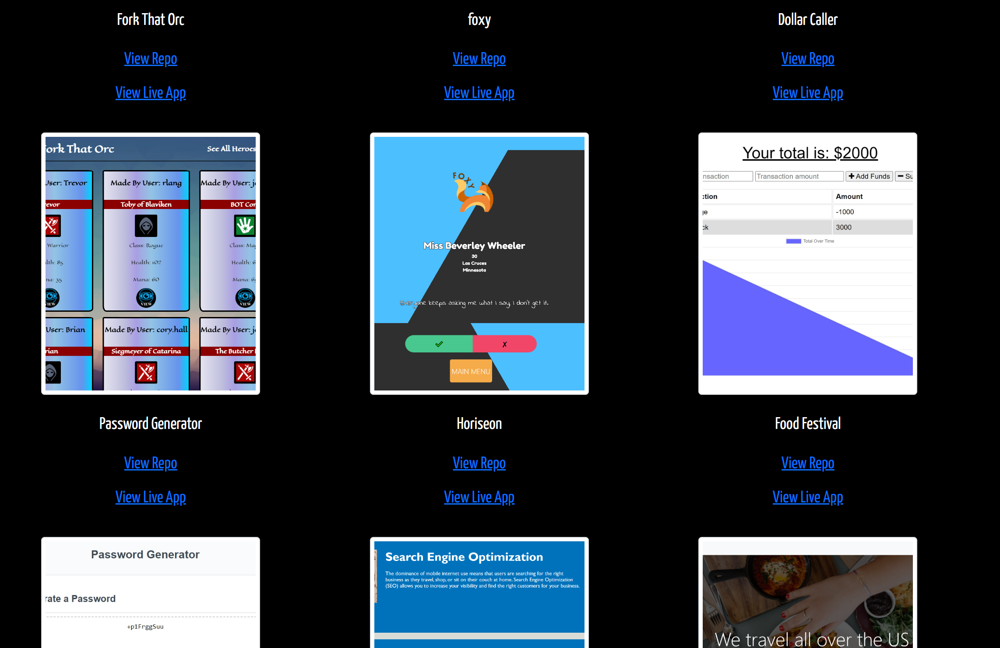
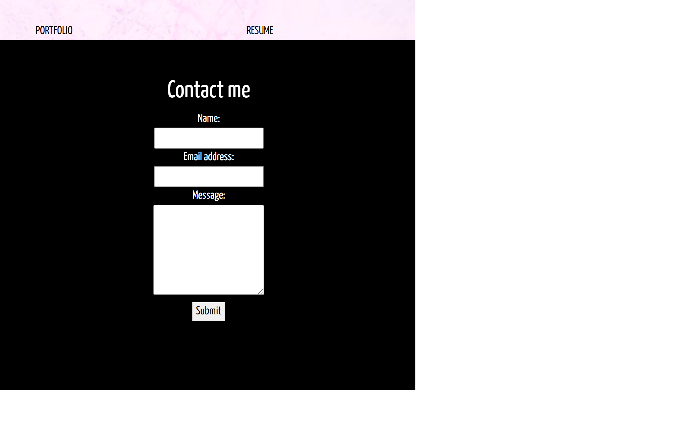

# React Portfolio 

  # About
  This is a web developer portfolio put together with React. It gives a brief description, showcases projects, provides a download for a resume, and has a contact box.
  
  ## Table of Contents
  - [Intallation](#installation)
  - [Usage](#usage)
  - [Credit](#credit)
  - [License](#license)
  - [Questions](#test)

  # Installation
  Clone the repo to view the code. When the repo is downloaded, run "npm i" at the root folder to install the node modules required. Once these have installed, run "npm start" to launch the app, and it will automatically open in your default browser window. 

  # Usage
  The default page upon opening is the About page. This gives a brief overview of who I am. At the top of the page, there are several links in the nav bar. Click any of these to be taken to their respect page. Under the resume page, click the link to download a copy of the resume. When viewing projects, click any of links to see that project's repo, as well as the live page itself to see the app running.
  
  

  # Credit
  Created by Austin Carter. 

  # License
  This project is covered under the gpl3.0 license. For more information, visit this [resource](https://choosealicense.com/licenses/) on project licenses.

  # Questions
  If you have any questions, you can find me on [github](https://github.com/auscarter17).
  

